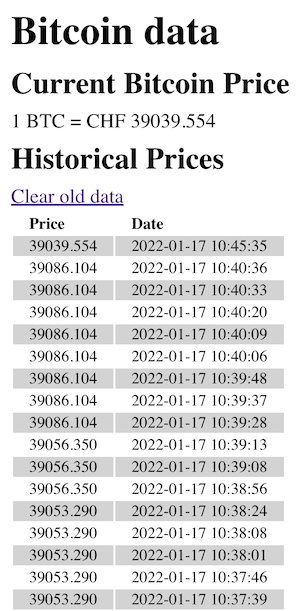

# Bitcoin Price Tracker

This project contains a Docker image that runs a web site that does
the following:

- shows stored BitCoin prices
- stores a new price on each refresh of the page
- prices older than 120 days can be purged via a link
- was developed from start to finish in 3 hours

The following instructions are for local testing and development.

See the [Development Journal](dev-notes.md) for how this project was developed.

## Assumptions

This project attempts to achieve the goal without using any framework, so it's
close "to the metal" in a way that a more professionally produced software would
not be.

## Requirements

- Docker

## Setup

- `cd ./bitcoin-docker`
- `docker-compose up -d`
- Browse to [http://localhost:80](http://localhost:80)
- Browse to [http://localhost:8080](http://localhost:8080) for PHPMyAdmin

## Demo

The application should look like the following once you've refreshed the page a few times.



## Troubleshooting

If the database is created but the table is not, then the initialization script didn't run properly.

In that case, just open [PHPMyAdmin](http://localhost:8080) and execute the following SQL manually:

```sql
CREATE TABLE `BitcoinPrices` (
                                 `id` int(6) NOT NULL AUTO_INCREMENT,
                                 `price_in_usd` decimal(10,3) NOT NULL DEFAULT '',
                                 `date` datetime NOT NULL DEFAULT '0000-00-00 00:00:00',
                                 PRIMARY KEY (`id`)
) ENGINE=MyISAM AUTO_INCREMENT=32 DEFAULT CHARSET=utf8 PACK_KEYS=1;
```